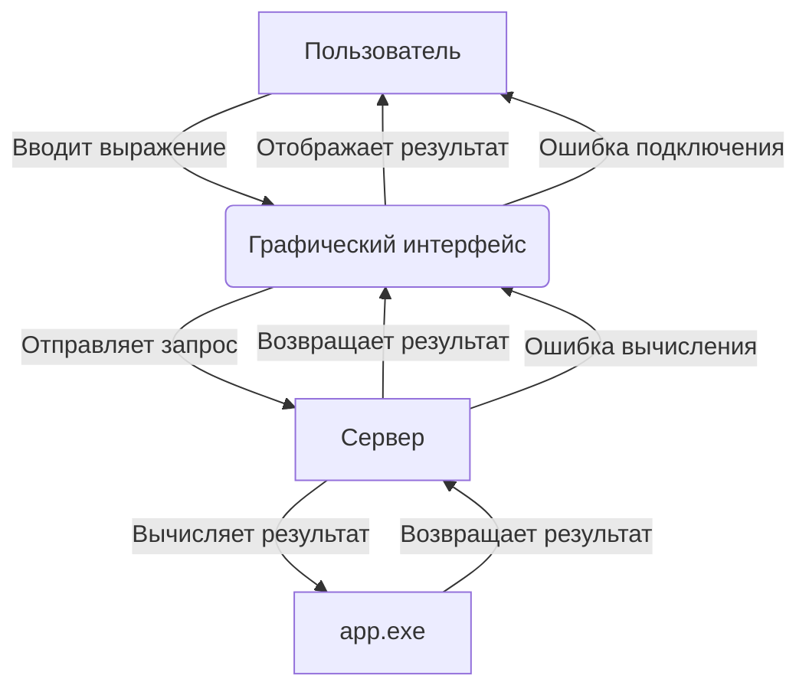

# calculator-kuznetsov-nd
A program written in C. It reads an arithmetic expression from standard input, parses it, and prints the result. The program supports the following operators on integers: `+` , `-` , `*` , `/` , `(` , and `)` . Any whitespace characters are allowed in input. 

## More in depth about the program

### Building the Program
To build the program, you need a C compiler such as `gcc` or `clang`. Follow these steps:
1. Open a terminal.
2. Navigate to the main directory containing the Makefile(`Makefile`).
3. Run the following command to compile the program.
```
make all
```
This will create an executable file named calculator.exe.

### Running the Program
To run the program in integer mode, use the following command:
```
make run-int
```
Use following command to run program in *real* numbers mode
```
make run-float
```
The program will prompt you to enter an arithmetic expression. After entering the expression, press `Enter` to see the result.

### Running the Server
To run the server in integer mode, use the following command:
```
make run-server
```

### Important remarks
- Input passed through `stdin`
- Output passed through `stdout`
- Less than 1KiB of input data (else `UB`)
- Only allowed charset `[0-9()*+\/\s\-]` (else code not equal to `0` returns)
  - `0-9` matches a single character in the range between 0 and 9 
  - `()*+` matches a single character in the list `()*+`
  - `\/` matches the character `/` 
  - `\s` matches any whitespace character (equivalent to `[\r\n\t\f\v ]` )
  - `\-` matches the character `-`
- Only correct arithmetic expression are allowed (else code not equal to `0` returns)
- All numbers in a given expression are integers from a range $[0 \dots 2 \times 10^9]$ (else `UB`)
- All intermediate results (for any allowed order of evaluation) are fit into range $[-2 \times 10^9 \dots + 2\times 10^9]$ (else `UB`)
- Supports flag `--float` that switch app calculations into *real* numbers mode
- In integer mode:
  - `/` return an integer part of an division (rounds towards `0`)
  - Answer must be given on a single line as an integer number (with `-` sign if negative)
- In *real* numbers mode:
  - `/` return a fraction number
  - Answer must be given on a single line as a real number (decimal notation) with an absolute accuracy $\pm 10^{-4}$
In any mode division on a number less than $10^{-4}$ are forbidden (else `UB`)

## Schedule
**08.03.2025:** Поиск партнёра

**09.03.2025:** Подключение к трекеру

**10.03.2025:** Открытие задач на создание сервера

**11.03.2025:** Курсач

**12.03.2025:** Исполнение задач

**13.03.2025:**
- Открытие задач на реализацию логирования
- Исполнение, коммиты и закрытие задач

**14.03.2025:** Тестирование

**15.03.2025:** Тестирование

**16.03.2025:** Исправление багов

| Задача                                      | Дата выполнения |
|---------------------------------------------|-----------------|
| KUHU-12: Базовый код (Инициализация GUI)    | 24.04.2025      |
| KUHU-13: Валидация ввода                    | 24.04.2025      |
| KUHU-14: Отправка запроса на сервер         | 24.04.2025     |
| KUHU-15: Добавление чекбокса для режима float | 24.04.2025      |
| KUHU-17: Обновление Makefile                | 24.04.2025      |
| KUHU-11: Создание графического интерфейса   | 24.04.2025      |

**17.04.2025-23.04.2025:** Отдых/Курсач

---

## Use-Case Диаграмма работы GUI


